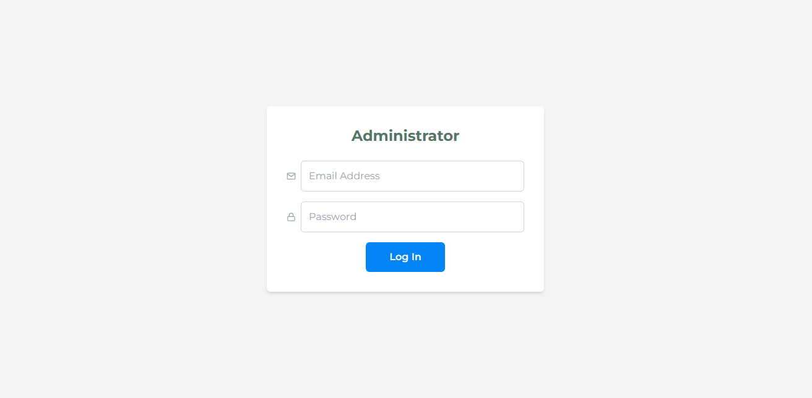

# Project Management System

It is a one-week project development after learning `Spring Framework`, `Spring Boot`, `Spring Data JPA`, and `Hibernate`.

___Project Management System___ is a web application for managing tasks. 

## Getting Started

To get a local copy up, follow these steps.

## Prerequisites

Before you begin, ensure you have installed the latest version of:

- JDK (Java Development Kit)
- IDE (IntelliJ IDEA, Eclipse, or VS Code)
- Git for version control management
- Node.js and npm

## Features

### Admin

- ___Administrator Login___ - for managing tasks and users.

- Dashboard
- Add project and collaborators
- View user and project
- Update project details
- Delete user and project

### Users

- Signup / Login 
- Time logs
- Dashboard
- View user details
- Update user details
- Delete user
- View project
- Update project status

