# Task Management System

It is a one-week project development after learning `Spring Framework`, `Spring Boot`, `Spring Data JPA`, and `Hibernate`.

**_Task Management System_** is a web application for managing tasks.

## Getting Started

To get a local copy up, follow these steps.

## Prerequisites

Before you begin, ensure you have installed the latest version of:

- JDK (Java Development Kit)
- IDE (IntelliJ IDEA, Eclipse, or VS Code)
- Git for version control management
- Node.js and npm

## Features

### Admin

- **_Login_** - for administrator to login into the system.

- **_Homepage_** - Displays total tasks and their status.

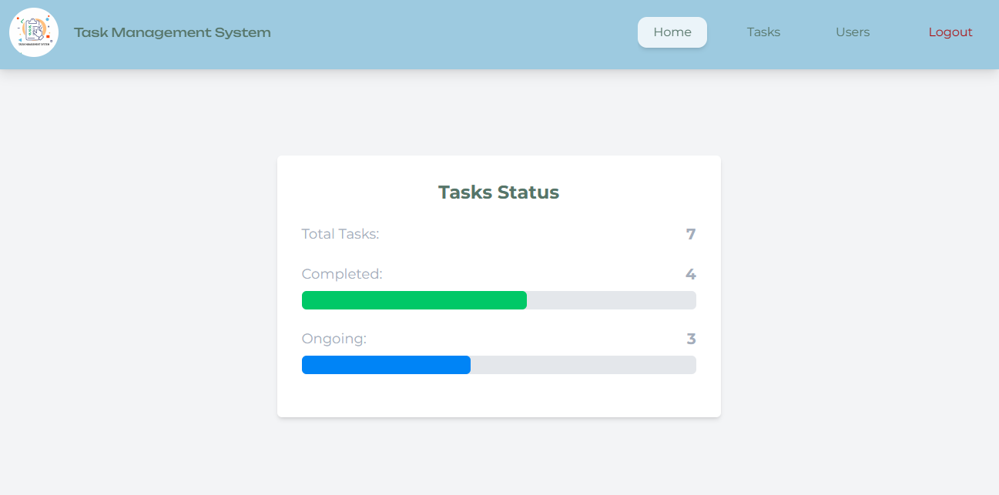

- **_Task Management_** - for managing tasks.

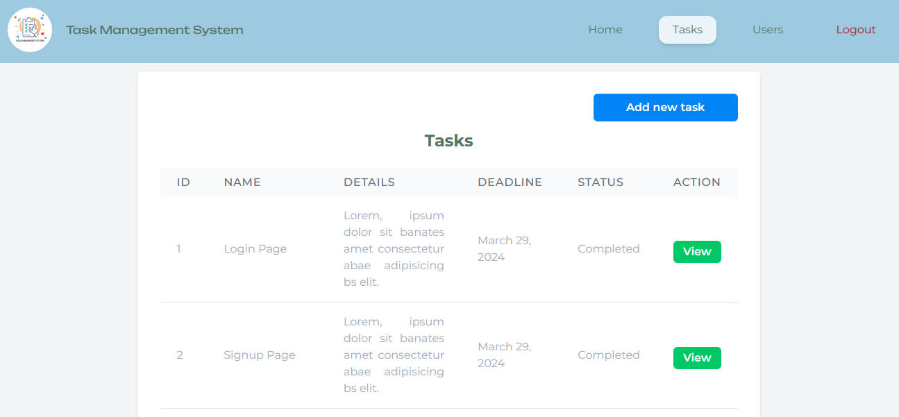

- **_a. Add New Task_**

- **_b. Task Details_**

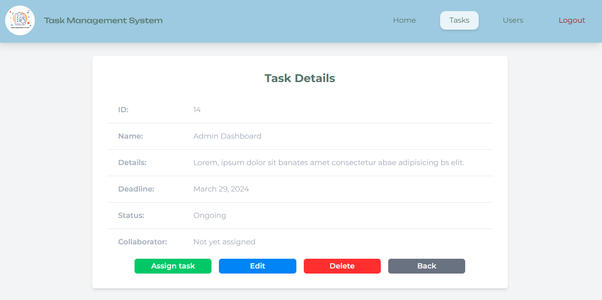

- **_c. Assign Task_**

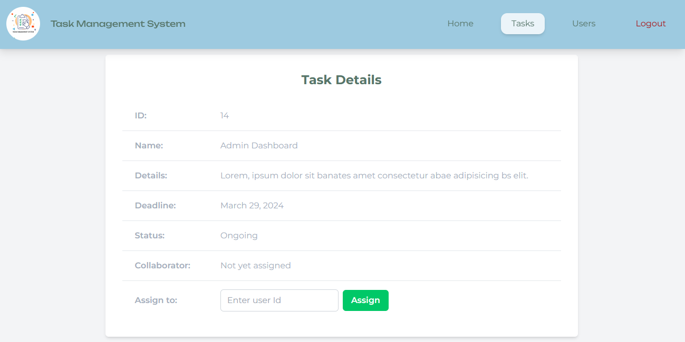

- **_d. Edit Task_**

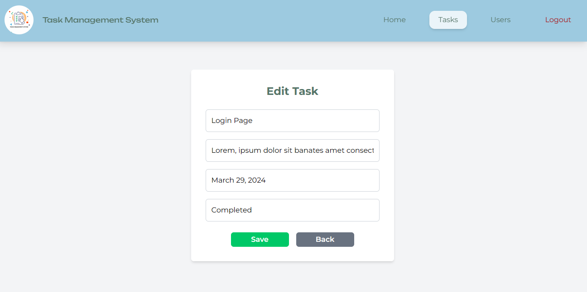

- **_e. Delete Task_**

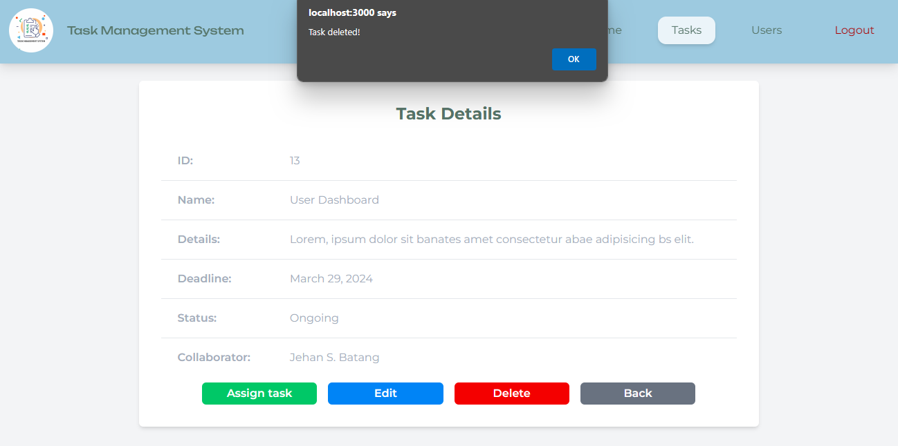

- **_View Users_** - Allows for assigning tasks and managing users.

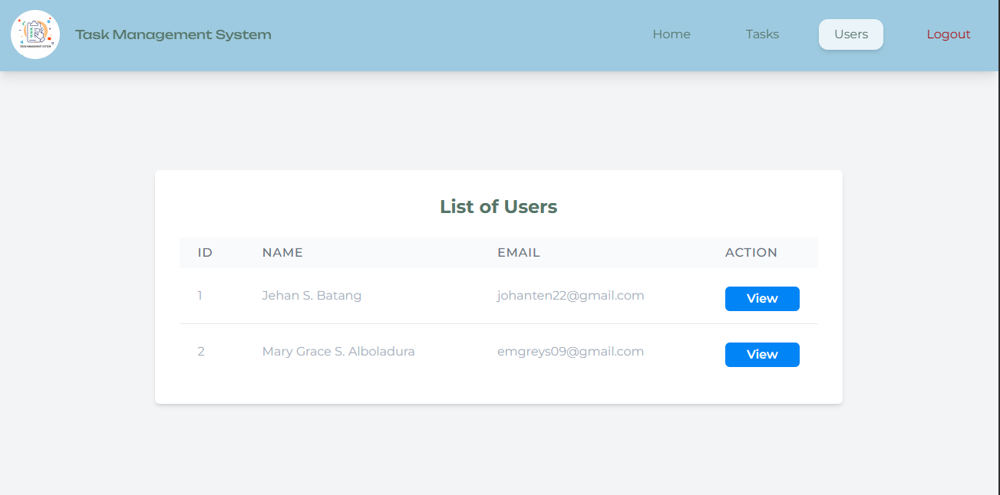

- **_a. Delete and View User Details_**

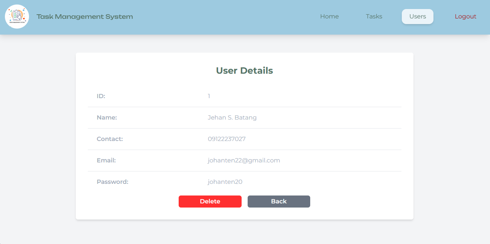

### Users

- **_Signup_** - for adding new users.

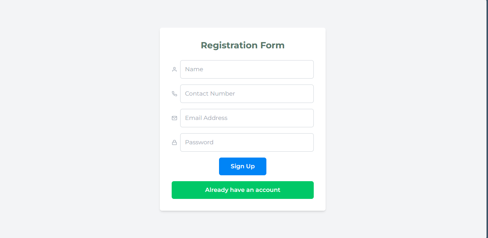

- **_Login_** - for users to login into the system.

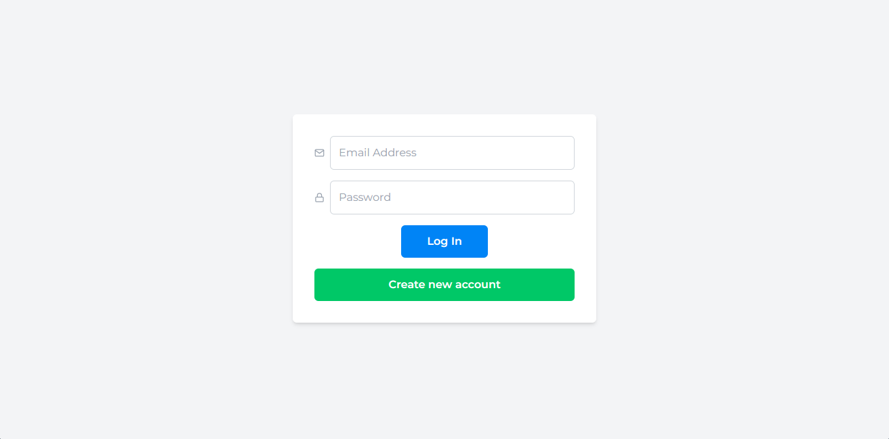

- **_User Homepage_** - Displays total tasks assigned to user and their status.

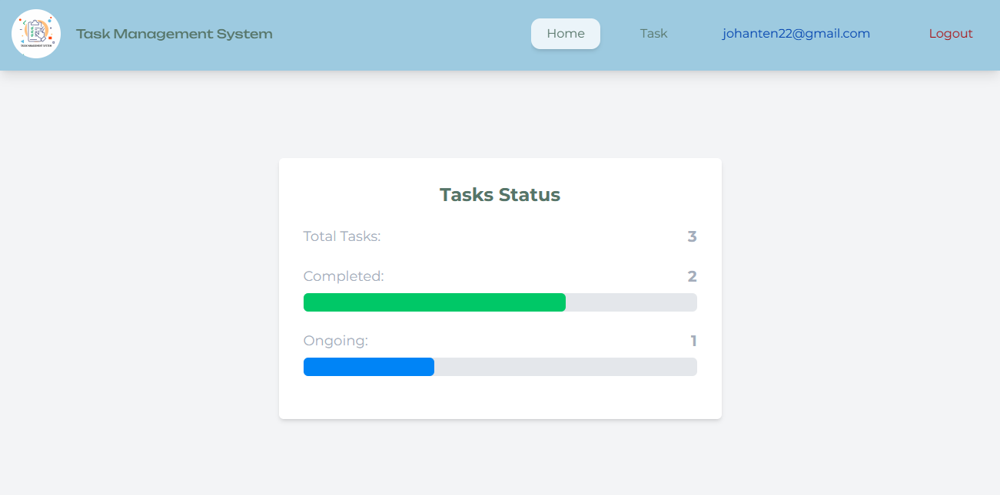

- **_View Task_** - view tasks assigned to the users.

- **_Update Task Status_**

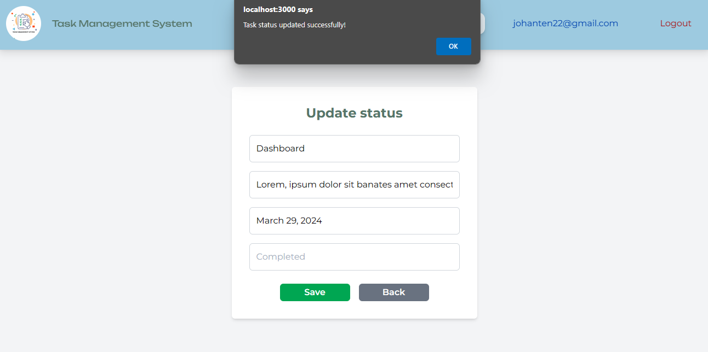

- **_View User Information_**

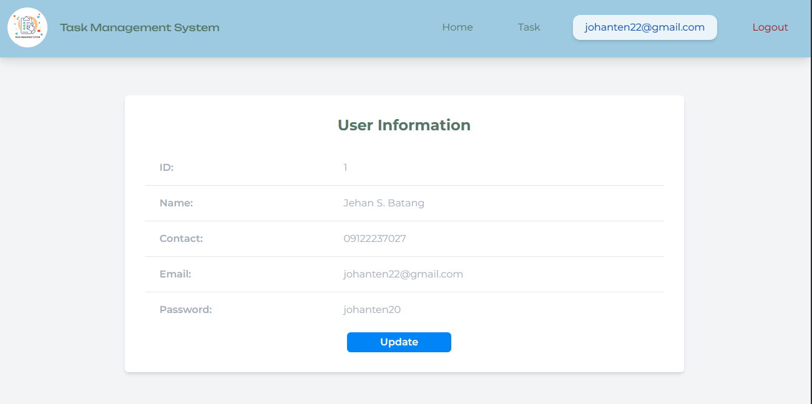

- **_Update User Information_**

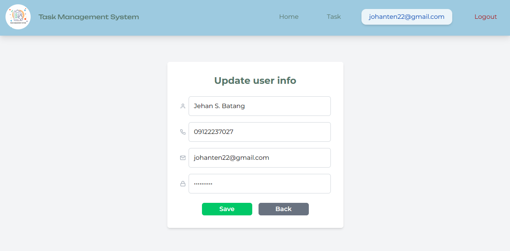
